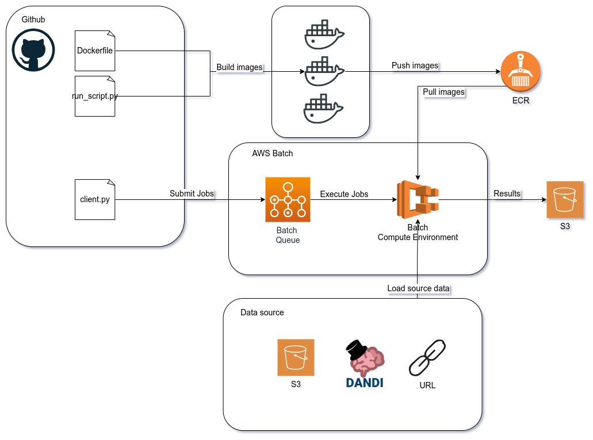

# SpikeInterface Cloud

A repository for scripts, configurations, Dockerfiles and documentation to run SpikeInterface sorters on the Cloud


Basic infrastructure makes use of the following AWS services:
- AWS Batch for queueing and serverless execution of computing jobs
- AWS ECR for hosting Docker images
- AWS S3 for storing jobs results
- AWS CloudWatch for logging




# Build and deploy the Docker images

Build docker image:
```bash
$ DOCKER_BUILDKIT=1 docker build -t <image-name:version> -f <Dockerfile_name> .
```

Run locally:
```bash
# With mounted volume
$ docker run \
    --gpus all \
    --env AWS_S3_BUCKET=${SOURCE_AWS_S3_BUCKET} \
    --env AWS_S3_BUCKET_FOLDER=${SOURCE_AWS_S3_BUCKET_FOLDER}  \
    --env DANDISET_S3_FILE_URL=${DANDISET_S3_FILE_URL}  \
    --env TARGET_AWS_S3_BUCKET=${TARGET_AWS_S3_BUCKET}  \
    --env TARGET_AWS_S3_BUCKET_FOLDER=${TARGET_AWS_S3_BUCKET_FOLDER}  \
    --env DATA_TYPE=${DATA_TYPE}  \
    --env READ_RECORDING_KWARGS=${READ_RECORDING_KWARGS}  \
    --env SORTERS=${SORTERS}  \
    --env AWS_REGION_NAME=${AWS_REGION_NAME}  \
    --env AWS_ACCESS_KEY_ID=${AWS_ACCESS_KEY_ID}  \
    --env AWS_SECRET_ACCESS_KEY=${AWS_SECRET_ACCESS_KEY}  \
    -v <host_path>:/results \
    <image-name:version>

# Run with access to a bash terminal inside the running container
$ docker run -it --gpus all --entrypoint /bin/bash <image-name:version>
```

Push image to ECR:
```bash
# Login to ECR - one of the two options should work
$ aws ecr get-login-password --region us-east-1 | docker login --username AWS --password-stdin <aws_id>.dkr.ecr.us-east-1.amazonaws.com
$ docker login -u AWS -p $(aws ecr get-login-password --region us-east-1) <aws_id>.dkr.ecr.us-east-1.amazonaws.com

# Tag image to comply with ECR
$ docker tag <image-name:version> <aws_id>.dkr.ecr.us-east-1.amazonaws.com/<image-name:version>

# Push image
$ docker push <aws_id>.dkr.ecr.us-east-1.amazonaws.com/<image-name:version>
```

If having difficulties pushing the image to ECR:
- make sure you created an ECR repository with the same name of the image you're pushing
- create a Permissions statement on ECR [ref](https://stackoverflow.com/a/72621029/11483674)

# AWS Batch configuration

0. Create IAM roles:
    - Create `AWSServiceRoleForBatch` ([ref](https://docs.aws.amazon.com/batch/latest/userguide/service_IAM_role.html)) 
    - Create `ecsInstanceRole` ([ref](https://docs.aws.amazon.com/batch/latest/userguide/instance_IAM_role.html)). The `ecsInstanceRole` should contain the `AmazonEC2ContainerServiceforEC2Role` permission. Optionally, attach another policy to the `ecsInstanceRole` to allow it to write logs to CloudWatch [ref](https://docs.aws.amazon.com/batch/latest/userguide/using_cloudwatch_logs.html)
    - Create `BatchJobsAccessRole` with permissions to read and write to S3 buckets (e.g. `AmazonS3FullAccess`), permissions to read from ECR (e.g. `AmazonEC2ContainerRegistryFullAccess`) and permissions to write logs to CloudWatch (e.g. `CloudWatchLogsFullAccess`). Configure the **Trusted entities** for this role like this:
    ```
    {
    "Version": "2012-10-17",
        "Statement": [
            {
                "Effect": "Allow",
                "Principal": {
                    "Service": "ecs-tasks.amazonaws.com"
                },
                "Action": "sts:AssumeRole"
            }
        ]
    }
    ```
1. (Optional) If dealing with larger files (> 20 Gb) and need a large storage:
    - Create a custom Launch Template on `EC2 > Launch Templates` [ref](https://docs.aws.amazon.com/batch/latest/userguide/launch-templates.html)
    - Choosing an AMI optimized for ECS and with GPU configurations, e.g. `amzn2-ami-ecs-gpu-hvm-2.0.20221025-x86_64-ebs`
    - Increase the EBS volume to the storage size you'll need
    - Create a resource tag with `Key=AWSBatchService`, `Value=batch` and `Resource types=Instances`
    - Attach the `ecsInstanceRole` created before to the `IAM instance profile`
    - Use this custom Launch Template when creating a new Compute Environment
2. Create a Compute environment (EC2)
    - Use the created IAMs roles: `Service Role=AWSServiceRoleForBatch` and `Instance Role=ecsInstanceRole`
    - Configure the instances available to be used by the environment. Instances with access to GPU (e.g. g4dn.2xlarge) might require you to request AWS to increase the quota limit for such machines, which by default is 0.
    - If you choose Spot instances, choose a value between 30~50% for the `Maximum % on-demand price`
3. Create a Job Queue (EC2) associated with the compute environment
4. Create a Job Definition (EC2)
    - Choose suitable Execution Timeout, Job Attempts and Retry Strategies
    - Select the base image
    - Command = `python run_script.py`
    - For the Execution role and Job role configuration, choose the `BatchJobsAccessRole`
    - Configure the resource requirements. Remember to choose a value for Memory slightly smaller than the value for the machines you're hoping to use, otherwise ECS might not find suitable instances.
    - Add any fixed ENV variables that should be used by any Jobs using this definition


# Submiting jobs

The job submission must include the function arguments, which are passed and ENV vars to the running container.
See [examples](https://github.com/catalystneuro/spikeinterface_cloud/tree/main/examples) of how to submit jobs with Python scripts.


# Debugging AWS Batch

AWS Batch uses a series of other AWS services under the hood. If something doesn't work as expected (e.g. a job gets stuck as RUNNABLE), there are several places to find the possible causes of failure:
- AWS Batch > Jobs > specific-job-details
- EC2 > Auto Scaling groups > specific-asg-details
- EC2 > Instances > specific-instance-details > Monitoring
- CloudTrail > Event history