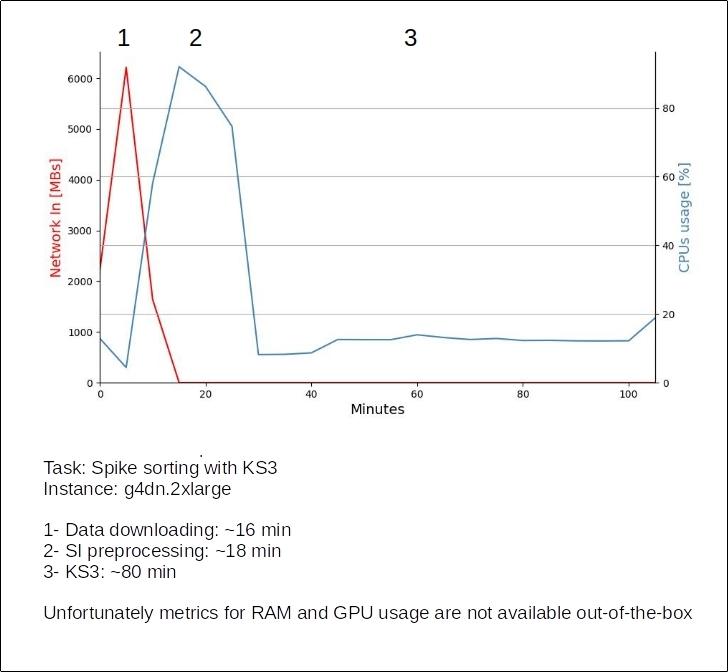

# Costs (conservative estimate)

ECR:
- storage: $0.10 per GB / month
- transfer out: $0.09 per GB transferred

S3:
- storage: $0.023 per GB / month
- requests: $0.005 (PUT, COPY, POST, LIST) or $0.0004 (GET, SELECT)
- transfer out: 100GB free per month, after that $0.02 per GB (other aws services) or $0.09 per GB (outside of aws)

EC2 – g4dn.2xlarge:
- compute resources: $0.752 / hour (on-demand price, it will be lower with spot instances)
- extra storage: $0.08/GB-month

This is the resources usage profile for a task downloading, processing and sorting 78 minutes of Neuropixels recordings. The estimate total cost for this run was ~1.44 USD.

